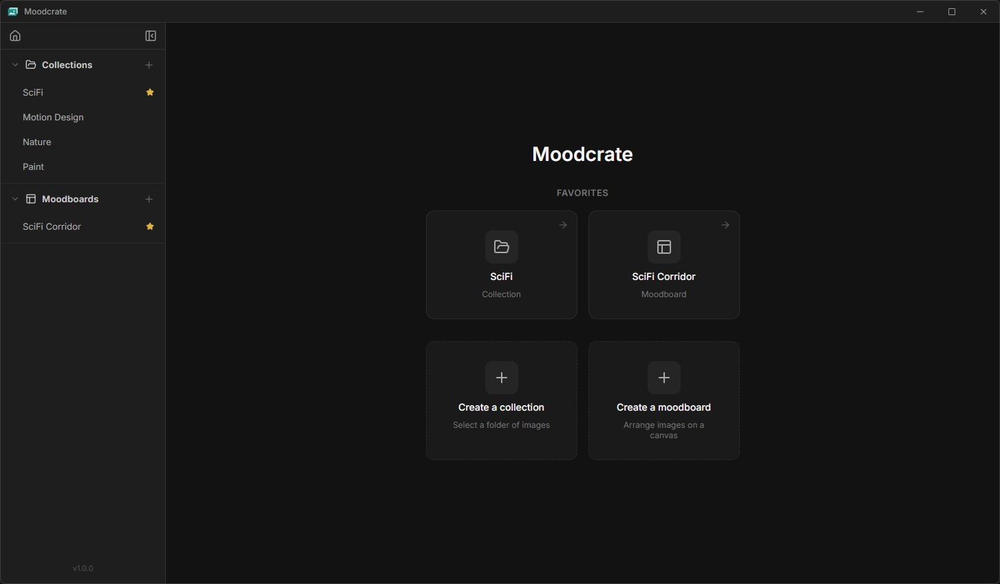
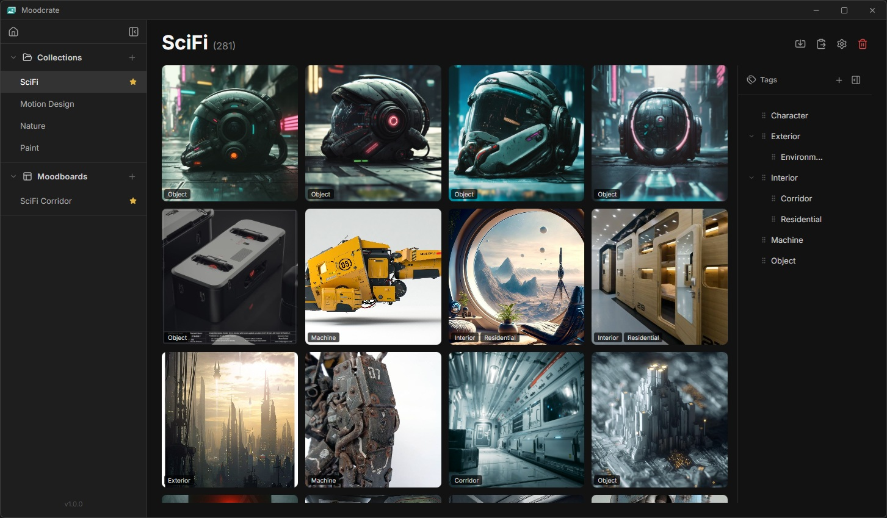
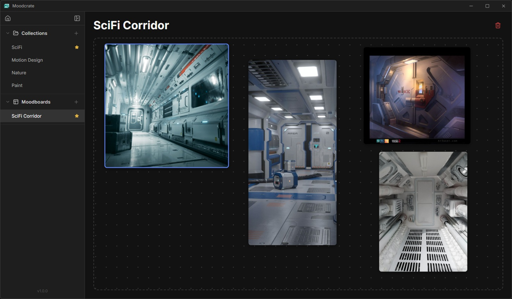

# Moodcrate

A desktop app for artists to gather, label, categorize visual references and create moodboards from selected images.

Built with **Tauri v2** (Rust) + **React 19** + **TypeScript** + **Vite**.



## Features

### Collections

Organize your visual references into collections — folders of images you can browse, tag, and filter.



- **Import images** via file picker or clipboard paste (copy or reference modes)
- **Grid view** with adjustable columns per row
- **Thumbnail caching** — images are resized to WebP thumbnails on first load, cached on disk for instant subsequent loads
- **Full-screen image viewer** at original resolution
- **Clear cache** per collection from the settings popover
- **Delete images** from collections

### Tags

A hierarchical tagging system to categorize and filter your images.

- **Create tags** with parent-child nesting (unlimited depth)
- **Drag-and-drop** tags in the sidebar to reorganize hierarchy
- **Tag images** directly from the collection grid
- **Filter by tag** — click the search icon on any tag to show only matching images (includes descendants)

### Moodboards

Free-form canvases to arrange your selected references spatially.



- **Infinite canvas** with pan (middle-click) and zoom (scroll wheel)
- **Add images** from any collection via the moodboard picker on each image tile
- **Create moodboards on the fly** — the "New moodboard" option in the picker creates a board, adds the image, and navigates to it
- **Freely arrange** images by dragging them on the canvas
- **Resize images** using the corner handle
- **Box-select** multiple images with a marquee (left-click drag on empty canvas)
- **Multi-drag** — move all selected images together
- **Shift+click** to toggle individual image selection
- **Zoom-to-fit** on open — the view automatically centers and scales to show all images
- **Dot grid background** for visual reference

### Home & Favorites

- **Home page** with quick-create actions for collections and moodboards
- **Favorite** any collection or moodboard via the star icon in the sidebar
- **Favorites overview** on the home page for quick access to starred items

### Performance

- **Asset protocol** — images loaded directly from disk by the webview, no base64/IPC overhead
- **Async thumbnail generation** — caching runs in background threads, UI stays responsive
- **Batched loading** — thumbnails load in batches of 20 with a progress indicator

### Interface

- **Settings popover** to adjust grid column count and clear thumbnail cache
- **Dark theme** throughout
- **NSIS uninstaller** cleans up app data and thumbnail cache on uninstall

## Installation

### Prerequisites

- [Rust](https://www.rust-lang.org/tools/install) 1.93+
- [Node.js](https://nodejs.org/) 24+ with npm

### Development

```bash
# Install dependencies
npm install

# Run in dev mode (hot reload)
npm run tauri dev
```

### Build

```bash
# Build production binary
npm run tauri build
```

The built installer will be in `src-tauri/target/release/bundle/`.

## Tech Stack

| Layer | Technology |
|---|---|
| Desktop shell | Tauri v2 (Rust) |
| Frontend | React 19 + TypeScript |
| Bundler | Vite |
| Icons | lucide-react |
| Persistence | localStorage |
| Image processing | image crate (Rust) — decode, resize, WebP encode |
| Tauri plugins | dialog, opener, clipboard-manager, window-state |

## Next Features

- Add text elements in a moodboard
- Add multiple images to a moodboard at once

## License

This project is licensed under the [GNU General Public License v3.0](LICENSE).
