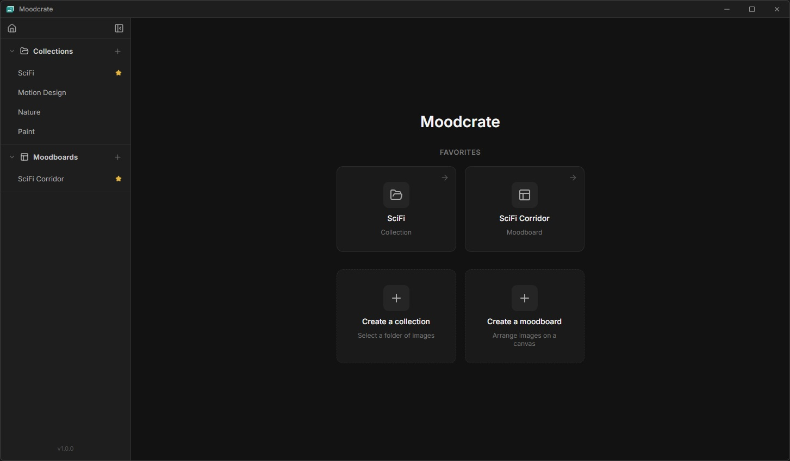
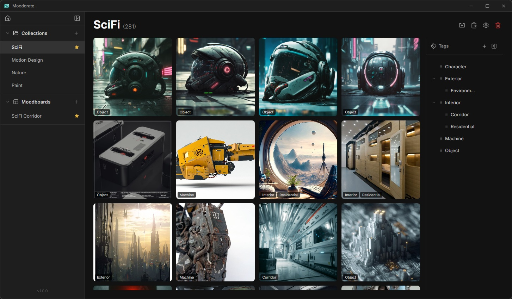
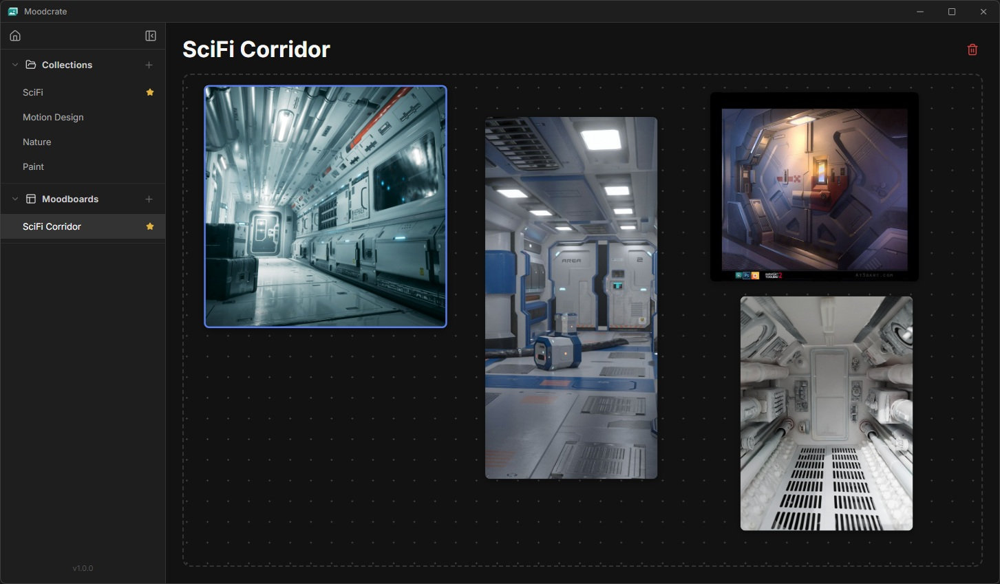

# Moodcrate

[](https://coveralls.io/github/CGSeb/moodcrate?branch=main)
[](https://github.com/CGSeb/moodcrate/releases/latest)

Moodcrate is a desktop app for artists to gather, tag, organize, and arrange visual references into moodboards.

Built with **Tauri v2** (Rust), **React 19**, **TypeScript**, and **Vite**.



## Features

### Collections

Organize references into collections you can browse, filter, and reuse.



- Import images from disk or the clipboard
- Choose copy or move import behavior
- Browse images in an adjustable grid
- Cache thumbnails on disk for faster reloads
- Open images in a full-screen viewer
- Clear a collection thumbnail cache from settings
- Delete images from a collection

### Tags

Use a hierarchical tag system to label and filter references.

- Create nested tags with unlimited depth
- Drag and drop tags to reorganize the tree
- Tag images directly from the collection grid
- Filter by a tag and all of its descendants

### Moodboards

Build free-form boards from selected references and text notes.



- Pan with middle mouse and zoom with the wheel
- Add a single image to an existing or new moodboard
- Batch-add multiple selected images at once
- Arrange images freely on the canvas
- Resize images with drag handles
- Box-select and multi-drag items together
- Add text blocks with Markdown rendering
- Edit text with font size, H1, H2, and bullet list controls
- Auto-fit content when opening a populated moodboard

### Home and Favorites

- Start from a home page with quick-create actions
- Favorite collections and moodboards from the sidebar
- Reopen favorites quickly from the home screen

### Performance

- Images load through the asset protocol directly from disk
- Thumbnail generation runs asynchronously
- Thumbnail loading is batched to keep the UI responsive

## Installation

### Prerequisites

- [Rust](https://www.rust-lang.org/tools/install) 1.93+
- [Node.js](https://nodejs.org/) 24+

### Development

```bash
npm install
npm run tauri dev
```

### Production Build

```bash
npm run tauri build
```

The built installer is written to `src-tauri/target/release/bundle/`.

## Testing

Run the test suite locally:

```bash
npm test
```

Run coverage locally:

```bash
npm run test:coverage
```

GitHub Actions also runs:

- `Coverage`: runs the Vitest suite, runs `cargo test`, generates frontend and Rust coverage, uploads the combined report to Coveralls, and stores the full `coverage/` report as a workflow artifact

## Tech Stack

| Layer | Technology |
|---|---|
| Desktop shell | Tauri v2 (Rust) |
| Frontend | React 19 + TypeScript |
| Bundler | Vite |
| Icons | lucide-react |
| Persistence | localStorage |
| Markdown | marked |
| Tauri plugins | dialog, opener, clipboard-manager, process, updater, window-state |

## License

This project is licensed under the [GNU General Public License v3.0](LICENSE).
